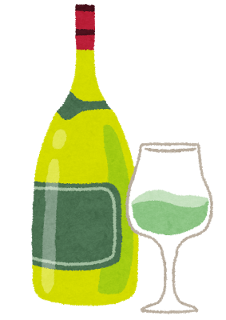

<!DOCTYPE html>
<html lang="ja">
  <head>
   <meta charset="utf-8">
   <link rel="stylesheet" href="css/styles.css">
  </head>
  <body>
    <header>
      <h1>DFooD</h1>
        
飲み物選びから始まる料理

    </header>
     

       <h1>ワインから選ぶ</h1>
      

       <section>
         <ul>
           <li>
             
            </li>
            <li>
              <a href="white-wine-list/index.html" class="btn">白ワイン</a>
            </li>
          </ul>
        </section>
     

  </body>
  <footer>
    (c) DfooD.com
  </footer>
</html>
